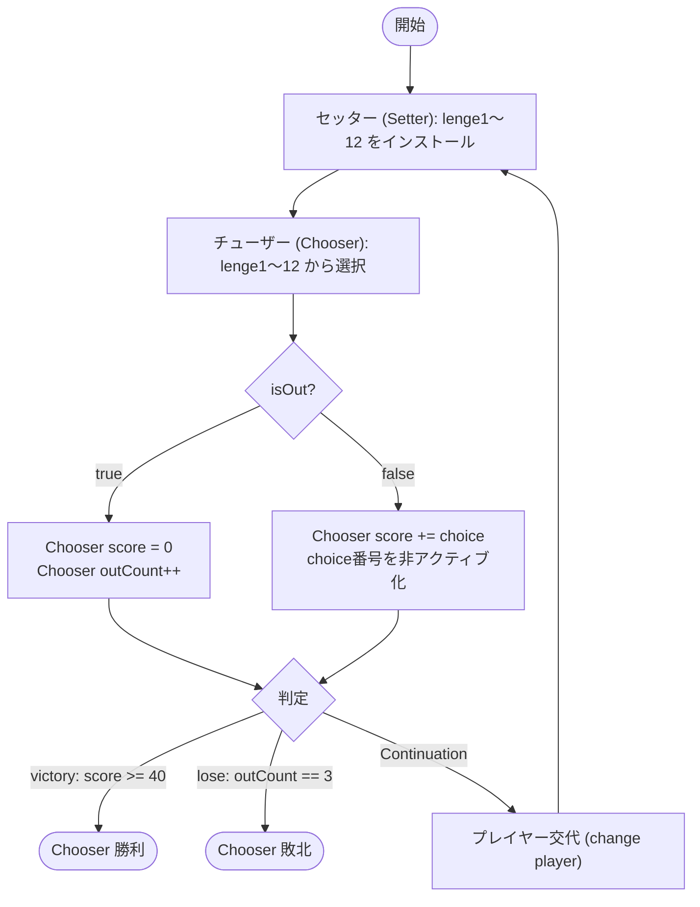

# ソフトウェア処理フロー

```mermaid
flowchart TD
    A([開始]) --> B

    B["セッター (Setter): lenge1〜12 をインストール"]
    B --> C

    C["チューザー (Chooser): lenge1〜12 から選択"]
    C --> D{isOut?}

    D -- true --> E["Chooser score = 0\nChooser outCount++"]
    D -- false --> F["Chooser score += choice\nchoice番号を非アクティブ化"]

    E --> G{判定}
    F --> G

    G -- "victory: score >= 40" --> H([Chooser 勝利])
    G -- "lose: outCount == 3" --> I([Chooser 敗北])
    G -- Continuation --> J["プレイヤー交代 (change player)"]

    J --> B
```
